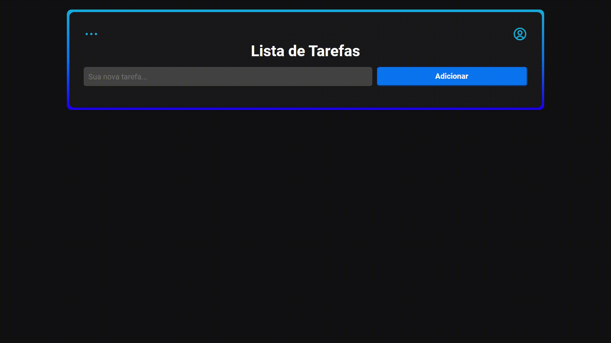

<h1 align="center">Lista de Tarefas</h1>

## Sobre o Projeto

Lista de tarefas básica com <strong>animações CSS</strong>, <strong>CRUD</strong> e uma <strong>API</strong> para consumo. Possui as seguintes funcionalidades:

- Adicionar uma nova tarefa.
- Completar uma tarefa.
- Editar uma tarefa.
- Remover uma tarefa.

Aplicação hospedada na <a href="https://lista-de-tarefas-basica.herokuapp.com/" rel="external">Heroku</a>.

Você pode conferir o <strong>back-end</strong> do projeto <a href="https://github.com/riandeoliveira/task-list-backend">aqui</a>.

## Demonstração

    </img>

## Tecnologias utilizadas

    <h3>Front-end</h3>
    </img>
    </img>
    </img>
    </img>
    </img>

    <h3>Back-end</h3>
    </img>
    </img>
    </img>

## Desenvolvido em

22 de fev. de 2022

Made with 💙 by <strong>Rian Oliveira</strong>

